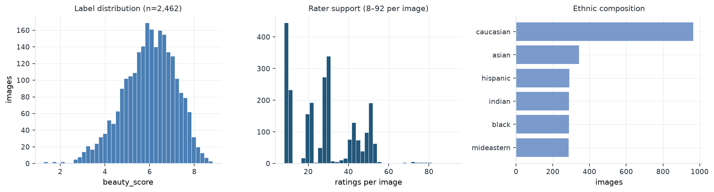
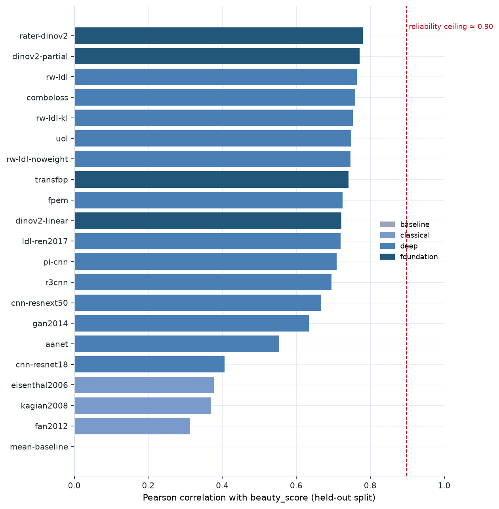

# FBP-Benchmark — Facial Beauty Prediction on MEBeauty

[](https://github.com/dr-irina-lebedeva/MEBeauty-Benchmark/actions/workflows/ci.yml)
[](https://www.python.org/downloads/)
[](LICENSE)
[](https://huggingface.co/datasets/dr-irina-lebedeva/MEBeauty)
[](https://huggingface.co/datasets/dr-irina-lebedeva/MEBeauty)

A reproducible benchmark for **facial beauty prediction (FBP)** — twenty-one methods
spanning twenty years, from hand-crafted facial geometry to foundation models, all
trained and scored under one protocol on the **MEBeauty** multi-ethnic dataset.

> **Academic research only.** The dataset is non-commercial, for facial
> attractiveness assessment research — **not** for face recognition,
> identification, verification, biometric matching or surveillance.
> If you use this benchmark or the dataset, please [cite the paper](#citation).

### Where things live

| | |
|---|---|
| **Dataset — improved, current** | [huggingface.co/datasets/dr-irina-lebedeva/MEBeauty](https://huggingface.co/datasets/dr-irina-lebedeva/MEBeauty) |
| **Benchmark code** | this repository |
| **Original 2021 release** *(dataset + code, superseded)* | [github.com/fbplab/MEBeauty-database](https://github.com/fbplab/MEBeauty-database) |
| **Paper** | [Neural Computing and Applications 34(17), 2022](https://doi.org/10.1007/s00521-021-06535-0) |

The Hugging Face release is a **corrected and re-audited version** of the
original: duplicate photographs merged, splits rebuilt so that images of the
same person cannot span a train/test boundary, provenance recorded per image,
and the label recomputed from the individual ratings. Counts differ from the
2021 release for those reasons, so **numbers from papers using the original
files are not directly comparable**. The original repository remains available
for reference.



*2,462 faces, each rated by 8–92 people from six ethnic groups. No face from
the dataset is reproduced here — the people shown did not consent to being
rated for attractiveness, so this repository describes the distributions
rather than displaying them.*

---

## Contents

- [Installation](#installation) · [Usage](#usage) · [Methods](#methods) · [Results](#results)
- [Evaluation protocol](#evaluation-protocol) — which numbers to report, and why
- [Reproducing the results](#reproducing-the-results) · [Extending the benchmark](#extending-the-benchmark)

## Installation

**Python 3.12 or newer.**

```bash
git clone https://github.com/dr-irina-lebedeva/MEBeauty-Benchmark
cd MEBeauty-Benchmark
uv sync --all-extras                 # recommended; installs Python 3.12 if needed
huggingface-cli login
```

With [uv](https://docs.astral.sh/uv/), prefix commands with `uv run`:
`uv run fbp-benchmark list`. To use pip instead, note that an editable install
of this project needs a recent pip as well as Python 3.12+:

```bash
python -m venv .venv && source .venv/bin/activate
python -m pip install --upgrade pip
pip install -e ".[all]"              # omit [all] for the CPU-only classical methods
```

**Dataset access.** The dataset is gated with automatic approval: accept the
terms on the [dataset page](https://huggingface.co/datasets/dr-irina-lebedeva/MEBeauty)
while signed in, then `huggingface-cli login` with a token from
[your settings](https://huggingface.co/settings/tokens).

Nothing else is required — no download script, no preprocessing step and no
local dataset directory. Images and labels stream from the Hub and are cached
by `datasets` (about 750 MB on first use).

## Usage

```bash
fbp-benchmark list                                    # the method catalogue
fbp-benchmark run --method dinov2-partial             # train and evaluate one method
fbp-benchmark run --era classical                     # an entire era
fbp-benchmark run --method comboloss --protocol cv --fold 0
fbp-benchmark report                                  # render results/ as a table
```

Each run writes `results/<method>.json` with its metrics, the protocol it used
and the commit that produced it, plus per-image predictions as `.npz`. Change
the destination with `--out`.

| Option | Purpose |
|---|---|
| `--protocol cv --fold N` | 5-fold cross-validation instead of the held-out split |
| `--epochs 1` | smoke test; overrides every schedule and is recorded in the result |
| `--dataset configs/mebeauty_rater_aware.yaml` | evaluate on a different dataset or config |
| `--save-weights DIR` | export trained weights |
| `--seed N` | change the seed (default 0) |

The classical methods and the baseline run on CPU in seconds; the deep and
foundation methods assume a GPU. `uol` is the slowest at roughly two hours.

From Python:

```python
from fbp_benchmark import load_protocol, run

protocol = load_protocol()
result = run("dinov2-partial", protocol)
print(result.metrics)  # {'PC': ..., 'SROCC': ..., 'MAE': ..., 'RMSE': ...}
```

## Evaluation protocol

Two protocols ship, and a result must state which it used.

**Cross-validation is the one to report.** The held-out split has 250 test
images, and a paired bootstrap cannot separate the top methods on it —
differences below roughly 0.04 correlation are not resolvable. The ordering of
the two best methods reverses between the two protocols, and only the
cross-validated difference is significant.

**Name the label.** `beauty_score` corrects for rater leniency and is the
recommended target; `plain_mean_score` is the uncorrected average. They
correlate 0.97 but differ by up to 1.2 on individual images.

**The ceiling is about 0.90.** Roughly 19% of the test-label variance is rater
sampling noise, so a perfect predictor would not reach 1.0. The strongest
method here reaches 0.80.

**Some methods are seed-sensitive.** `cnn-resnet18` ranges 0.41-0.71 across
four seeds under its published SGD schedule. Schedules are not retuned here,
so a single-seed number for an unstable method is one draw; cross-validation
averages five and is the safer figure.

**Test differences, do not eyeball them.**
`fbp_benchmark.metrics.paired_bootstrap_difference` returns the difference, a
95% interval and a p-value for any two methods' predictions.

Splits are fixed and grouped so that photographs of the same person never
cross a boundary; the benchmark never re-derives them.

## Notes

| | |
|---|---|
| `GatedRepoError` / `401` | accept the dataset terms, then `huggingface-cli login` |
| `needs individual ratings` | that method requires `--dataset configs/mebeauty_rater_aware.yaml` |
| Results differ in the third decimal | expected across CUDA / MPS / CPU; ordering holds |

## Methods

```bash
fbp-benchmark list          # names, eras, and what each one needs
```

<!-- METHODS:START -->

**Baseline** — reference points that bound the table

| Method | Paper |
|---|---|
| `mean-baseline` | -- — floor: predicts the training mean |

**Classical** — landmark geometry with a shallow regressor

| Method | Paper |
|---|---|
| `eisenthal2006` | [Eisenthal, Dror & Ruppin 2006, Neural Computation 18(1)](https://doi.org/10.1162/089976606774841602) |
| `fan2012` | [Fan et al. 2012, Pattern Recognition 45(6)](https://doi.org/10.1016/j.patcog.2011.11.024) |
| `kagian2008` | [Kagian et al. 2008, Vision Research 48(2)](https://www.sciencedirect.com/science/article/pii/S0042698907005032) |

**Deep** — convolutional networks trained end to end

| Method | Paper |
|---|---|
| `aanet` | [Lin et al. 2019, IJCAI (AaNet / P-AaNet)](https://doi.org/10.24963/ijcai.2019/119) |
| `cnn-resnet18` | [Liang et al. 2018, ICPR (SCUT-FBP5500 baseline)](https://arxiv.org/abs/1801.06345) |
| `cnn-resnext50` | [Liang et al. 2018, ICPR (SCUT-FBP5500 best backbone)](https://arxiv.org/abs/1801.06345) |
| `comboloss` | [Xu & Xiang 2020, arXiv:2010.10721](https://arxiv.org/abs/2010.10721) |
| `fpem` | [Li et al. 2025, ICCV (FPEM: Face Prior Enhanced Facial Attractiveness Prediction for Live Videos), arXiv:2501.02509](https://arxiv.org/abs/2501.02509) |
| `gan2014` | [Gan et al. 2014, Neurocomputing 144](https://doi.org/10.1016/j.neucom.2014.05.028) — reimplementation; no external unlabelled corpus |
| `ldl-ren2017` | [Ren & Geng 2017, IJCAI](https://www.ijcai.org/proceedings/2017/369) |
| `pi-cnn` | [Xu et al. 2017, ICASSP](https://ieeexplore.ieee.org/document/7952438) |
| `r3cnn` | [Lin, Liang & Jin 2019/2022, IEEE Trans. Affective Computing](https://doi.org/10.1109/TAFFC.2019.2933523) |
| `rw-ldl` | This work (reliability-weighted LDL) — proposed |
| `rw-ldl-kl` | This work (ablation: no multinomial likelihood) — ablation: KL instead of multinomial |
| `rw-ldl-noweight` | This work (ablation: no precision weighting) — ablation: no reliability weighting |
| `transfbp` | [Xu, Jinhai & Yuan 2018, arXiv:1803.07253 (TransFBP)](https://arxiv.org/abs/1803.07253) — frozen face-verification features + Bayesian ridge; no fine-tuning |
| `uol` | [Liang et al. 2024, arXiv:2409.00603 (Uncertainty-oriented Order Learning)](https://arxiv.org/abs/2409.00603) |

**Foundation** — large pretrained backbones, frozen or lightly adapted

| Method | Paper |
|---|---|
| `dinov2-linear` | [Oquab et al. 2024 (DINOv2) + this benchmark](https://arxiv.org/abs/2304.07193) — frozen backbone, linear head |
| `dinov2-partial` | [Oquab et al. 2024 (DINOv2) + this benchmark](https://arxiv.org/abs/2304.07193) — last blocks unfrozen |
| `rater-dinov2` | proposed in this benchmark — proposed: rater effects on a foundation backbone |
| `vit-fbp` | [Boukhari 2023, IJEETC 13(3) (ViT-FBP)](https://www.ijeetc.com/vol13/IJEETC-V13N3-252.pdf) — plain ViT-B/16, fine-tuned end to end |
| `xattn-vit` | Boukhari & Dornaika 2026 (cross-attention ViT) — ViT-B/16 backbone |

Entries without a link are published in venues with no stable open URL; the citation is given in full. Most entries are **reimplementations** — they preserve the published mechanism, not the original weights or feature extractors, so a score is evidence about this implementation on this dataset rather than a verdict on the original work.

<!-- METHODS:END -->

## Results



<!-- RESULTS:START -->

### Held-out split

`dr-irina-lebedeva/MEBeauty` config `fbp_extended`, label `beauty_score`, seed 0 — train 1,962 / val 250 / test 250.

| Method | Era | PC | SROCC | MAE | RMSE | Time |
|---|---|---|---|---|---|---|
| `mean-baseline` | baseline | -0.0000 | 0.0000 | 0.9107 | 1.1512 | 0s |
| `eisenthal2006` | classical | 0.3769 | 0.3928 | 0.8549 | 1.0672 | 1s |
| `kagian2008` | classical | 0.3694 | 0.3849 | 0.8989 | 1.1091 | 0s |
| `fan2012` | classical | 0.3115 | 0.3295 | 0.9235 | 1.1416 | 0s |
| `rw-ldl` | deep | 0.7643 | 0.7540 | 0.5749 | 0.7429 | 468s |
| `comboloss` | deep | 0.7599 | 0.7617 | 0.5958 | 0.7538 | 2799s |
| `rw-ldl-kl` | deep | 0.7530 | 0.7411 | 0.6012 | 0.7598 | 175s |
| `uol` | deep | 0.7487 | 0.7411 | 0.6062 | 0.7764 | 8504s |
| `rw-ldl-noweight` | deep | 0.7470 | 0.7302 | 0.5984 | 0.7666 | 206s |
| `fpem` | deep | 0.7255 | 0.7151 | 0.6251 | 0.7922 | 429s |
| `ldl-ren2017` | deep | 0.7202 | 0.7137 | 0.6381 | 0.7987 | 180s |
| `pi-cnn` | deep | 0.7087 | 0.7127 | 0.6374 | 0.8138 | 1862s |
| `r3cnn` | deep | 0.6949 | 0.6919 | 0.6616 | 0.8372 | 332s |
| `cnn-resnext50` | deep | 0.6672 | 0.6457 | 0.6635 | 0.8611 | 1145s |
| `gan2014` | deep | 0.6342 | 0.6353 | 0.7160 | 0.9060 | 70s |
| `aanet` | deep | 0.5522 | 0.5779 | 0.7431 | 0.9655 | 260s |
| `cnn-resnet18` | deep | 0.4065 | 0.4817 | 0.8336 | 1.0609 | 138s |
| `rater-dinov2` | foundation | 0.7798 | 0.7734 | 0.5662 | 0.7206 | 2232s |
| `dinov2-partial` | foundation | 0.7711 | 0.7669 | 0.5658 | 0.7373 | 1413s |
| `dinov2-linear` | foundation | 0.7223 | 0.7319 | 0.6476 | 0.8267 | 903s |

### 5-fold cross-validation

Every image is tested exactly once across the folds, so this is the comparison to trust — the held-out split has only 250 test images, too few to separate methods within about 0.04 correlation.

| Method | Era | PC (mean ± sd) | SROCC (mean ± sd) | MAE (mean ± sd) | RMSE (mean ± sd) |
|---|---|---|---|---|---|
| `dinov2-partial` | foundation | 0.8035 ± 0.0136 | 0.8022 ± 0.0104 | 0.5371 ± 0.0061 | 0.7056 ± 0.0231 |
| `rater-dinov2` | foundation | 0.7959 ± 0.0196 | 0.7932 ± 0.0183 | 0.5562 ± 0.0182 | 0.7243 ± 0.0291 |

<!-- RESULTS:END -->

**The held-out split cannot separate the top methods.** With 250 test images a
paired bootstrap puts the gap between the best two at p = 0.48. Under 5-fold
cross-validation the ordering reverses and becomes significant
(p < 0.001), which is why the CV table is the one to cite.

## Why this exists

Facial beauty prediction has a reproducibility problem. Published numbers come from
different datasets, different splits, different label definitions and different training
schedules — and then get printed in the same table. This repository fixes everything
except the method.

Three things are held constant:

- **One dataset, one split.** Loaded from the Hub, not rebuilt locally. Photographs of
  the same person never appear in two splits.
- **One label.** `beauty_score`, named in every result file.
- **One evaluation.** The harness owns the metrics; no method can define its own.

One thing is deliberately *not* held constant: each method trains under **its own
paper's schedule** (`setups.py`), not a shared config. A benchmark that retunes every
method measures the benchmark author's tuning rather than the literature. Where a
published setting could not transfer, the deviation is recorded in that method's entry
with the paper's own words beside it.

## Reproducing the results

Every number in the tables above came from these commands. Results carry the
commit that produced them, so a run can be reproduced or knowingly discounted.

```bash
git clone https://github.com/dr-irina-lebedeva/MEBeauty-Benchmark
cd MEBeauty-Benchmark
uv sync --locked --all-extras --dev     # or: pip install -e ".[all]"

huggingface-cli login                   # dataset is gated, approval automatic

# Held-out table: every method, its own paper's schedule
fbp-benchmark run --out results

# Cross-validation table: the comparison to trust
for fold in 0 1 2 3 4; do
  fbp-benchmark run --method dinov2-partial --protocol cv --fold $fold \
    --out results/cv/fold$fold
done

fbp-benchmark report                    # render, or --update-readme
```

Two methods need a richer dataset config than the default:

```bash
# rw-ldl and rater-dinov2 need the individual per-rater ratings
fbp-benchmark run --method rater-dinov2 --dataset configs/mebeauty_rater_aware.yaml
```

**What to expect.** The full held-out sweep took ~5.5 hours on an Apple M-series
laptop; `uol` alone is 2h20m. Deep methods are seeded and deterministic given
the same torch version and device, but exact reproduction across a different
device (CUDA vs MPS vs CPU) will differ in the third decimal.

## Trained models

Weights are saved on request and can be published to the Hub alongside the
dataset:

```bash
fbp-benchmark run --method dinov2-partial --save-weights checkpoints
huggingface-cli upload dr-irina-lebedeva/MEBeauty-models checkpoints/
```

A checkpoint stores each module's `state_dict` keyed by name (`backbone`,
`head`, and any method-specific parts), so it reloads without needing this
package's internals. Methods with no tensors — the classical regressors and
the baseline — write nothing rather than an empty file.

> Checkpoints are not published yet. The weights behind the tables above were
> not retained: the sweep predated `--save-weights`, and re-running it to
> produce them is ~5.5 hours of compute. Reproduce locally with the commands
> above, or open an issue if hosted weights would help you.

## Extending the benchmark

### Using your own dataset

Nothing here is specific to MEBeauty except the defaults. A dataset works if one row is
one face, with an image column and a numeric label. Describe it in YAML:

```yaml
# configs/my_dataset.yaml
repo_id: your-org/your-dataset
config: default
image_column: image
label_column: beauty_score
score_range: [1.0, 5.0]     # SCUT-style 1-5 rather than MEBeauty's 1-10
distribution_column: null   # no histogram -> LDL methods are skipped
landmark_column: null       # no landmarks -> classical methods are skipped
```

```bash
fbp-benchmark run --dataset configs/my_dataset.yaml
```

Missing optional columns disable the methods that need them, with a readable error
rather than a silent fallback — a distribution method handed zeros would report a
plausible bad score, which reads as *weak method* instead of *misconfigured run*.

### Adding a method

Decorate a class. There is no second list to keep in sync:

```python
from fbp_benchmark.registry import register


@register("my-method", era="deep", reference="Author et al., 2027", trainable=True)
class MyMethod:
    def fit(self, protocol): ...
    def predict(self, split): ...  # -> Prediction(scores=...)
```

`trainable=True` means the method is built from an entry in `setups.py`, so its
schedule is recorded rather than improvised.

## What the harness guarantees

- **No test-label leakage.** Every method runs twice, the second time with the test
  labels shuffled. If predictions move, the run fails. This is the single mistake that
  would invalidate a whole table, so it is checked rather than trusted.
- **Distribution metrics only when they mean something.** Scored only if the method
  predicted a distribution *and* the dataset ships a real histogram — never against one
  reconstructed from a mean.
- **Era-grouped ranking.** The leaderboard ranks within era. Putting a 2006 geometric
  regressor on the same line as a fine-tuned transformer invites a conclusion neither
  supports.

## Layout

```
src/fbp_benchmark/
  data.py            load from the Hub; DatasetSpec is the only place a dataset is described
  registry.py        @register - name, era, reference, requirements
  runner.py          train, predict, score, write
  metrics.py         point and distribution measures
  setups.py          each method's schedule, quoted from its paper
  reproducibility.py seeding and environment capture
  methods/
    base.py          the Method interface and the mean baseline
    training.py      shared DataLoader / early-stopping machinery
    classical.py     landmark geometry
    deep.py          the CNN era
    foundation.py    large pretrained backbones
    proposed.py      reliability-weighted LDL
configs/             dataset specifications
results/             one JSON per method
```

## Development

```bash
uv sync
make check           # lint + fast tests
make test-slow       # end-to-end; downloads pretrained weights
```

## Citation

```bibtex
@article{lebedeva2022mebeauty,
  title   = {MEBeauty: a multi-ethnic facial beauty dataset in-the-wild},
  author  = {Lebedeva, Irina and Guo, Yi and Ying, Fangli},
  journal = {Neural Computing and Applications},
  volume  = {34},
  number  = {17},
  pages   = {14169--14183},
  year    = {2022},
  doi     = {10.1007/s00521-021-06535-0}
}
```

## Licence and scope

Code is MIT. **The dataset is not** — it is for non-commercial academic research on
facial attractiveness assessment only, and specifically not for face recognition,
identification or any biometric use. See the
[dataset card](https://huggingface.co/datasets/dr-irina-lebedeva/MEBeauty) for the full
terms, which you accept when requesting access.

Attractiveness ratings are subjective opinions of the people who gave them. A model
trained here predicts what those raters said; it does not measure a property of anyone
shown.

**Maintainer:** Irina Lebedeva, PhD — dr.irina.lebedeva@gmail.com ·
[irina-lebedeva.com](https://irina-lebedeva.com/) ·
[LinkedIn](https://www.linkedin.com/in/ailina/)

---

## Keywords

Facial beauty prediction · facial attractiveness prediction · facial aesthetics ·
beauty score regression · MEBeauty dataset · multi-ethnic face dataset ·
FBP benchmark · SCUT-FBP5500 comparison · label distribution learning ·
DINOv2 · vision transformer · foundation models · deep learning ·
affective computing · face analysis · reproducible research · PyTorch

`facial-beauty-prediction` `facial-attractiveness` `facial-aesthetics`
`beauty-prediction` `fbp` `mebeauty` `benchmark` `computer-vision`
`deep-learning` `affective-computing` `label-distribution-learning`
`foundation-models` `dinov2` `face-analysis` `reproducible-research` `pytorch`
