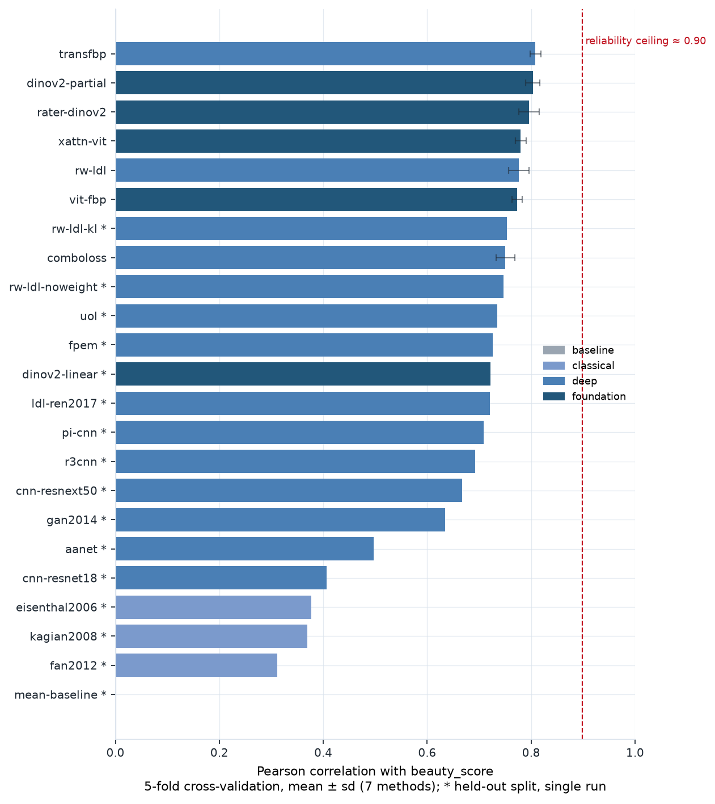

# FBP-Benchmark — Facial Beauty Prediction on MEBeauty

[](https://github.com/dr-irina-lebedeva/MEBeauty-Benchmark/actions/workflows/ci.yml)
[](https://www.python.org/downloads/)
[](LICENSE)
[](https://huggingface.co/datasets/dr-irina-lebedeva/MEBeauty-Facial-Beauty-Prediction)
[](https://huggingface.co/datasets/dr-irina-lebedeva/MEBeauty-Facial-Beauty-Prediction)

A reproducible benchmark for **facial beauty prediction (FBP)** — twenty-one
methods spanning twenty years, from hand-crafted facial geometry to foundation
models, all trained and scored under one protocol on the **MEBeauty**
multi-ethnic dataset. Each method runs under its own paper's schedule rather
than a retuned shared config, and every result records the commit that produced
it.

> **Academic research only.** The dataset is non-commercial, for facial
> attractiveness assessment research — **not** for face recognition,
> identification, verification, biometric matching or surveillance.
> If you use this benchmark or the dataset, please [cite the paper](#citation).

| | |
|---|---|
| **Dataset** | [huggingface.co/datasets/dr-irina-lebedeva/MEBeauty-Facial-Beauty-Prediction](https://huggingface.co/datasets/dr-irina-lebedeva/MEBeauty-Facial-Beauty-Prediction) |
| **Trained models** | [dr-irina-lebedeva/MEBeauty-FBP-models](https://huggingface.co/dr-irina-lebedeva/MEBeauty-FBP-models) — `dinov2-partial` reference weights |
| **Original 2021 release** *(dataset + code, superseded)* | [github.com/fbplab/MEBeauty-database](https://github.com/fbplab/MEBeauty-database) |
| **Paper** | [Neural Computing and Applications 34(17), 2022](https://doi.org/10.1007/s00521-021-06535-0) |

## Quick start

**Python 3.12 or newer.** The dataset is gated with automatic approval: accept
the terms on the [dataset page](https://huggingface.co/datasets/dr-irina-lebedeva/MEBeauty-Facial-Beauty-Prediction)
while signed in, then log in with a token from
[your settings](https://huggingface.co/settings/tokens).

```bash
git clone https://github.com/dr-irina-lebedeva/MEBeauty-Benchmark
cd MEBeauty-Benchmark
uv sync --all-extras                        # or: pip install -e ".[all]"
hf auth login

fbp-benchmark run --method dinov2-partial   # train and evaluate one method
```

## Results



<!-- RESULTS:START -->

**5-fold cross-validation** — every image tested exactly once, and the numbers to cite.

| Method | Era | PC (mean ± sd) | SROCC (mean ± sd) | MAE (mean ± sd) | RMSE (mean ± sd) |
|---|---|---|---|---|---|
| `transfbp` | deep | 0.8081 ± 0.0103 | 0.8118 ± 0.0118 | 0.5265 ± 0.0079 | 0.6916 ± 0.0207 |
| `dinov2-partial` | foundation | 0.8035 ± 0.0136 | 0.8022 ± 0.0104 | 0.5371 ± 0.0061 | 0.7056 ± 0.0231 |
| `rater-dinov2` | foundation | 0.7959 ± 0.0196 | 0.7932 ± 0.0183 | 0.5562 ± 0.0182 | 0.7243 ± 0.0291 |
| `xattn-vit` | foundation | 0.7801 ± 0.0105 | 0.7779 ± 0.0176 | 0.5707 ± 0.0230 | 0.7394 ± 0.0151 |
| `rw-ldl` | deep | 0.7766 ± 0.0197 | 0.7753 ± 0.0152 | 0.5777 ± 0.0206 | 0.7464 ± 0.0362 |
| `vit-fbp` | foundation | 0.7730 ± 0.0094 | 0.7705 ± 0.0115 | 0.5776 ± 0.0204 | 0.7466 ± 0.0239 |
| `comboloss` | deep | 0.7506 ± 0.0182 | 0.7520 ± 0.0174 | 0.5999 ± 0.0132 | 0.7835 ± 0.0169 |

For the held-out split, all twenty-one methods and the run provenance, see [docs/results.md](docs/results.md).

<!-- RESULTS:END -->

`transfbp` leads both protocols, but its margin over `dinov2-partial` does not
survive the larger sample (+0.007 correlation, p = 0.26, n = 2,462) — read the
two as tied at the top.

## Documentation

| | |
|---|---|
| [Evaluation protocol](docs/evaluation-protocol.md) | which numbers to report, and why; what the harness guarantees; troubleshooting |
| [Methods](docs/methods.md) | all twenty-one methods with paper links |
| [Results](docs/results.md) | the full tables, every method and both protocols |
| [Reproducing the results](docs/reproducing.md) | the exact commands, CLI options, and exporting weights |
| [Extending the benchmark](docs/extending.md) | your own dataset, adding a method, repository layout |

## Citation

```bibtex
@article{lebedeva2022mebeauty,
  title   = {MEBeauty: a multi-ethnic facial beauty dataset in-the-wild},
  author  = {Lebedeva, Irina and Guo, Yi and Ying, Fangli},
  journal = {Neural Computing and Applications},
  volume  = {34},
  number  = {17},
  pages   = {14169--14183},
  year    = {2022},
  doi     = {10.1007/s00521-021-06535-0}
}
```

## Licence and scope

Code is MIT. **The dataset is not** — it is for non-commercial academic
research on facial attractiveness assessment only, and specifically not for
face recognition, identification or any biometric use. See the
[dataset card](https://huggingface.co/datasets/dr-irina-lebedeva/MEBeauty-Facial-Beauty-Prediction)
for the full terms, which you accept when requesting access.

Attractiveness ratings are subjective opinions of the people who gave them. A
model trained here predicts what those raters said; it does not measure a
property of anyone shown.

**Maintainer:** Irina Lebedeva, PhD — dr.irina.lebedeva@gmail.com ·
[irina-lebedeva.com](https://irina-lebedeva.com/) ·
[LinkedIn](https://www.linkedin.com/in/ailina/)
